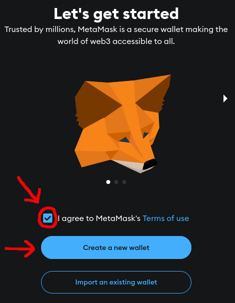
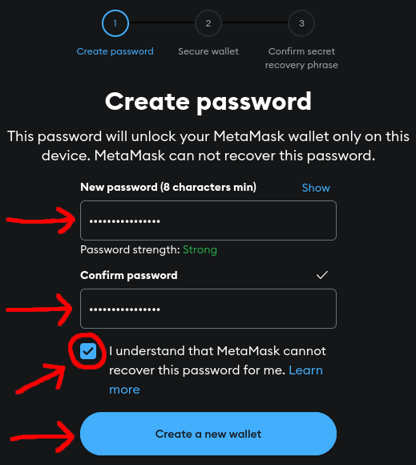
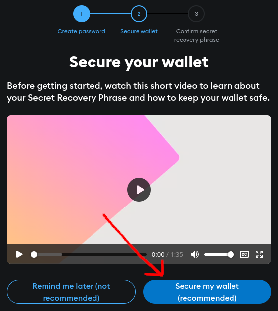
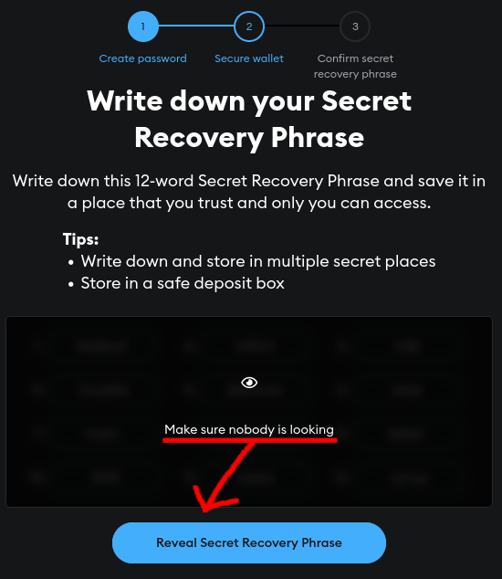
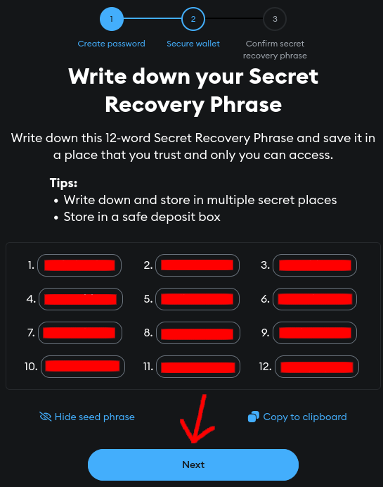
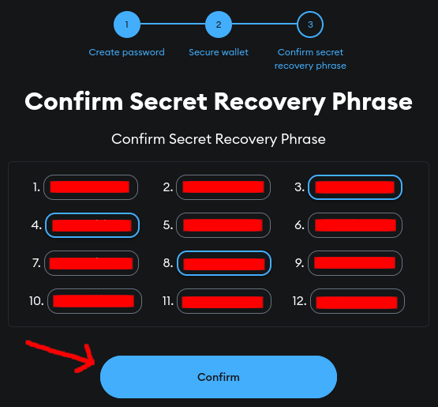

# Setting up a wallet

Obviously, to interact with the Web3 ecosystem, you need a crypto wallet that integrates with it. You can use any modern Web3 wallet you prefer, but we recommend MetaMask as it is the most established and known one.

Further instructions will assume MetaMask is being used for the sake of simplicity. If you already have your wallet installed and running or know how to do it yourself, you can skip this section entirely and go to the next one. If you're new to Web3 or crypto altogether, we'll guide you through installing MetaMask and setting up your wallet for the first time.

## Installing MetaMask

MetaMask is available both as an extension on desktop browsers (Firefox-based and Chromium-based) and as a native application on mobile platforms (Android and iOS).

Go to the [MetaMask](https://metamask.io/) website and click or tap on "Get MetaMask". You will be redirected to your platform's app or extension store. If you wish, you can also get it directly from the [Firefox Add-On Store](https://addons.mozilla.org/pt-BR/firefox/addon/ether-metamask/) or [Chrome Web Store](https://chromewebstore.google.com/detail/metamask/nkbihfbeogaeaoehlefnkodbefgpgknn) (for desktop), [Google Play](https://play.google.com/store/apps/details?id=io.metamask) or the [Apple App Store](https://apps.apple.com/us/app/metamask-crypto-wallet/id1438144202) (for mobile).

## Creating a MetaMask wallet

After installation, open MetaMask and you'll be greeted with a welcome screen and two buttons - one for creating a new wallet, and another for importing an existing wallet using a backup seed.

People familiar with crypto might already have a backup seed of their wallet - they would ideally just choose "Import an existing wallet", import their seed and skip straight to the next section. Since we're assuming the perspective of a new user who has never used a crypto wallet before, we'll create a new wallet from scratch.

The first step is to check the "I agree to MetaMask's Terms of use" box and choose the "Create a new wallet" option, as shown here:

<figure><figcaption>
MetaMask on first boot
</figcaption></figure>

MetaMask will then ask if you want to help with improving their software by sending basic usage and diagnostics data to them. You can do as you please here, either click on "I agree" or "No thanks".

### Creating the wallet's password

The next step is creating a strong password for your wallet. ***PLEASE NOTE IT DOWN AND STORE IT ON A SAFE AND SECURE PLACE!*** In the land of crypto, you're fully responsible for your wallet's security (this includes both the password *and* the seed, which we'll get to later).

Once you have a good enough password, type it on the box, re-type it to confirm, carefully read and check the checkbox below, then proceed with creating your wallet:

<figure><figcaption>
Register your password and never lose it!
</figcaption></figure>

### Storing the wallet's backup seed

MetaMask will then ask you to secure your wallet by noting down your secret recovery phrase (also known as a "seed" or "backup seed"). We ***STRONGLY*** recommend you do this, as that's the ***ONLY*** way you can recover your wallet in case something bad happens to it. ***NEVER*** show or share it to ***ANYONE*** either, as that'll give them direct access to your funds. Just like with your password, you should note it down and store it on a safe and secure place only you know.

We can't stress this enough. Always keep in mind: *"Not your keys, not your coins"*.

After watching the video and reading the rest of the info on the screen, choose the "Secure my wallet" option:

<figure><figcaption>
This is very important! Do not skip!

</figcaption></figure>

The next screen will show you a box where your backup seed is written. Click or tap on "Reveal Secret Recovery Phrase" (after ensuring you're totally isolated from prying eyes 👀) and note the words down in the order they're in:

<figure><figcaption>
This is meant for my eyes only...

</figcaption></figure>

<figure><figcaption>
...and I mean it!

</figcaption></figure>

Once you're done, choose "Next". MetaMask will ask you to complete your own seed with the missing words to make sure you've properly noted it down. Type the missing words in order accordingly and choose "Confirm":

<figure><figcaption>
You know the words, right? ...<i>right</i>? 😬

</figcaption></figure>

### Finishing

You're done! The wallet is now created. Be sure to read what MetaMask has to say in the next few screens and proceed to your wallet's main screen.

Now you're ready to add AppLayer's network to your wallet. We have separate instructions for our mainnet and testnet respectively - check the following subchapters according to where you want to go next.
